# INTERNSHIP REPORT
## on
# AI BASED UNDERWATER SCENE UNDERSTANDING AND INTELLIGENT OBJECT CLASSIFICATION FOR ROV OPERATIONS

**Submitted by**
* S.KISHORE &nbsp; G.YOKESH &nbsp; D.YAMINI &nbsp; R.NAVYA SREE

**B.TECH – COMPUTER SCIENCE AND ENGINEERING**
**VEL TECH RANGARAJAN DR.SAGUNTHALA R&D INSTITUTE OF SCIENCE AND TECHNOLOGY**

**Submitted to**
* NATIONAL INSTITUTE OF TECHNICAL TEACHERS TRAINING AND RESEARCH (NITTTR), Chennai – 600113
* **Internship Duration**: 1 JUNE 2026 to 1 JULY 2026

**Under the guidance of**
* **Dr. Balasubramanian Esakki**
  Professor, Mechanical Engineering

---
<!-- PAGE 2: ABSTRACT & GUIDANCE -->

## Abstract & Guidance

**National Institute of Technical Teachers Training and Research (NITTTR) Chennai - 600113**

### ABSTRACT:
Underwater environmental perception and scene understanding are essential capabilities for intelligent Remotely Operated Vehicles (ROVs) used in marine exploration, underwater infrastructure inspection, environmental monitoring, oceanographic research, and search-and-rescue operations. Traditional underwater computer vision techniques often struggle to accurately detect and classify objects due to challenges such as low visibility, color distortion, light attenuation, suspended particles, and complex underwater backgrounds. To address these limitations, this paper proposes an **AI-Based Underwater Scene Understanding and Intelligent Object Classification Framework** that integrates advanced deep learning models and vision-language techniques for comprehensive underwater perception and analysis.

The proposed framework combines **UHD-UOD** for underwater image enhancement and feature optimization, **MarineFormer** for transformer-based underwater scene representation and contextual feature extraction, **AquaticCLIP** for semantic vision-language understanding and underwater object recognition, and **Grounding DINO** for open-vocabulary object detection and localization. By integrating these models, the system enhances degraded underwater images, extracts robust spatial and semantic features, detects both known and unseen underwater objects, and generates comprehensive scene interpretations. The framework enables accurate identification of marine organisms, underwater structures, and artificial objects while improving scene understanding, object localization, and intelligent decision-making for autonomous ROV navigation.

### INTRODUCTION:
Underwater scene understanding and intelligent object classification have emerged as important research areas in **Artificial Intelligence (AI), Computer Vision, Marine Robotics, and Autonomous Underwater Systems**. With the increasing use of Remotely Operated Vehicles (ROVs) in marine exploration, offshore infrastructure inspection, environmental monitoring, underwater archaeology, and search-and-rescue missions, there is a growing demand for intelligent systems capable of accurately perceiving and interpreting complex underwater environments. Underwater scene understanding refers to the ability of an intelligent system to analyze underwater images, identify marine objects, understand environmental context, and interpret spatial relationships within underwater scenes. These capabilities are essential for enabling ROVs to perform safe navigation, intelligent decision-making, and autonomous operations in challenging underwater conditions.

---
<!-- PAGE 3: INTRODUCTION CONTINUED -->

## Introduction (Contd.)

**National Institute of Technical Teachers Training and Research (NITTTR) Chennai - 600113**

This project proposes an **AI-Based Underwater Scene Understanding and Intelligent Object Classification Framework** that integrates multiple state-of-the-art deep learning models to achieve comprehensive underwater environmental analysis. The framework utilizes **UHD-UOD (Underwater High-Definition Underwater Object Detection)** for underwater image enhancement, color restoration, and feature optimization to improve image quality in low-visibility conditions. **MarineFormer** is employed for transformer-based underwater scene representation and contextual feature extraction, enabling robust understanding of complex marine environments. **AquaticCLIP** provides vision-language semantic learning for accurate recognition and classification of marine organisms and underwater objects using multimodal representations. **Grounding DINO** performs open-vocabulary object detection and localization, allowing the system to detect both predefined and previously unseen underwater objects through natural language prompts.

---
<!-- PAGE 4: WEEK 1 - STUDY OF UNDERWATER SCENE UNDERSTANDING ALGORITHMS -->

## Week 1 - Study of Underwater Scene Understanding Algorithms:

During the first week of the NITTTR internship, an extensive study was conducted on advanced **Deep Learning, Transformer-based, and Vision-Language Models** used for AI-Based Underwater Scene Understanding and Intelligent Object Classification for ROV Operations. The primary objective was to understand the working principles, applications, advantages, and integration possibilities of modern AI algorithms for intelligent underwater perception and analysis. The following enhanced algorithms were studied:

1. **UHD-UOD**
   * Studied underwater image enhancement techniques for improving image quality in low-visibility underwater environments.
   * Understood underwater color correction, dehazing, contrast enhancement, and feature optimization methods.
   * Learned how image restoration improves object detection performance. Analyzed noise reduction caused by water scattering and light attenuation.
   * Explored applications in underwater exploration, marine inspection, and autonomous ROV navigation.

2. **MarineFormer**
   * Studied transformer-based underwater scene understanding techniques.
   * Learned how self-attention mechanisms capture long-range dependencies between underwater objects.
   * Understood contextual feature extraction for complex marine environments.
   * Analyzed underwater object classification and scene representation methods. Explored applications in marine biodiversity monitoring, underwater robotics, and intelligent ocean exploration.

3. **AquaticCLIP**
   * Studied semantic vision-language learning techniques for underwater environments.
   * Learned how underwater image features are aligned with textual descriptions for object recognition.
   * Understood multimodal feature representation for marine organisms and underwater structures.
   * Analyzed zero-shot and few-shot underwater object classification methods. Explored advanced semantic scene understanding for intelligent underwater monitoring.

4. **Grounding DINO**
   * Studied the concept of open-vocabulary object detection.
   * Understood how textual prompts are used to detect arbitrary underwater objects.
   * Learned cross-modal matching between underwater image features and text features.
   * Analyzed object localization using bounding boxes and confidence scores. Explored applications in marine life detection, underwater infrastructure inspection, and autonomous ROV systems.

---
<!-- PAGE 5: WEEK 2 - PAPER PRESENTATION ON ALGORITHMS -->

## Week 2 – Paper Presentation on Algorithms Based on Underwater Scene Understanding

During the second week of the NITTTR internship, a technical paper presentation was conducted focusing on advanced **Deep Learning, Transformer-based, and Vision-Language Models** applied to underwater scene understanding and intelligent object classification for ROV operations. The objective of the presentation was to study how modern AI algorithms can improve underwater image enhancement, scene understanding, object detection, semantic reasoning, and intelligent decision-making in marine environments.

1. **UHD-UOD**
   * It was presented as an underwater image enhancement framework designed to improve the quality of degraded underwater images.
   * In underwater environments, the algorithm performs color correction, dehazing, contrast enhancement, and feature optimization to restore image clarity affected by light absorption and water scattering.
   * The presentation highlighted its ability to improve underwater object visibility, enhance feature extraction, and increase the performance of underwater object detection systems used in ROV operations.

2. **MarineFormer**
   * The presentation explored the role of MarineFormer as a transformer-based underwater scene understanding model.
   * MarineFormer extracts rich contextual features from underwater images using self-attention mechanisms and captures long-range relationships among marine objects.
   * The presentation demonstrated how the model improves underwater scene representation, object classification, and environmental understanding in complex underwater conditions. It also highlighted its applications in marine biodiversity monitoring, underwater exploration, and intelligent robotic navigation.

3. **AquaticCLIP**
   * AquaticCLIP was studied as a vision-language model designed for underwater semantic understanding.
   * The presentation explained how the model aligns underwater image features with textual descriptions to recognize marine organisms, underwater structures, and artificial objects.
   * It supports zero-shot and few-shot learning, enabling the recognition of previously unseen underwater objects.
   * The presentation emphasized its ability to enhance semantic understanding and intelligent scene interpretation for underwater monitoring systems.

4. **Grounding DINO**
   * The presentation discussed Grounding DINO as an open-vocabulary object detection model capable of detecting underwater objects using natural language prompts.
   * In underwater environments, the algorithm identifies fish, coral reefs, underwater vegetation, pipelines, marine debris, and submerged structures without requiring predefined object categories.
   * The model performs cross-modal matching between visual features and text descriptions, allowing flexible object detection in dynamic marine environments.
   * The study highlighted its ability to improve underwater object localization, recognition, and intelligent ROV navigation.

---
<!-- PAGE 6: UHD-UOD WORKFLOW (Exactly one page!) -->

## UHD-UOD WORKFLOW DIAGRAM

The workflow schematic for UHD-UOD (Underwater Hybrid Feature Underwater Object Detection) details image acquisition, enhancement, multi-scale feature extraction, hybrid fusion, deep neural network detection, and final bounding-box regression output:

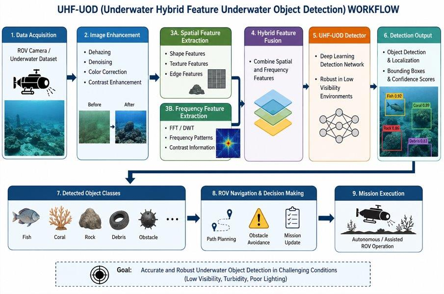

---
<!-- PAGE 7: MARINE FORMER WORKFLOW (Exactly one page!) -->

## MARINE FORMER WORKFLOW DIAGRAM

The self-attention based Marine Former workflow maps the biological and water datasets through an interactive smart aquaculture conservation hub, streaming insights to the Underwater Segment Anything (SAM) decoder:

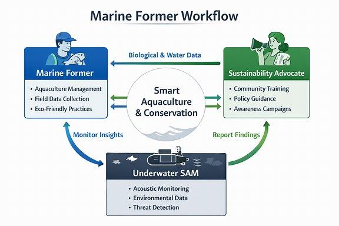

---
<!-- PAGE 8: AQUATIC CLIP & GROUNDING DINO WORKFLOWS (Exactly one page!) -->

## AQUATIC CLIP & GROUNDING DINO WORKFLOWS

* **ROV AquaticCLIP Workflow (Multi-modal zero-shot classification)**
  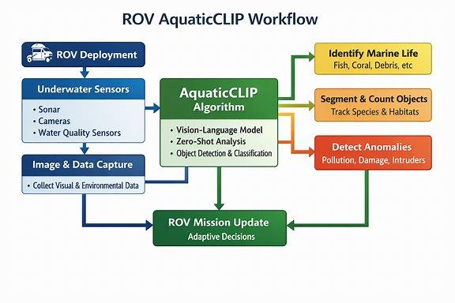

* **Grounding DINO Workflow (Submerged robotic image acquisition)**
  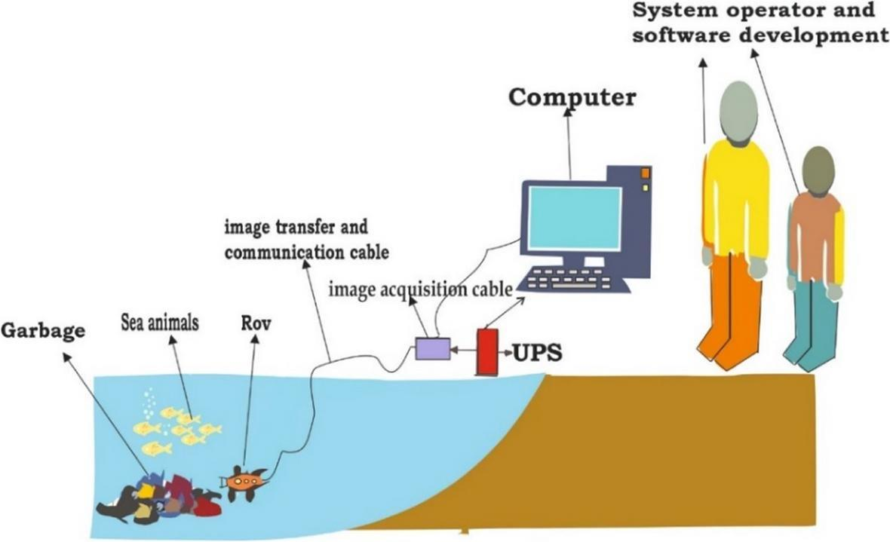

---
<!-- PAGE 9: WEEK 3 - RESULT ANALYSIS -->

## Week 3 – Result Analysis

During the third week of the NITTTR internship, result analysis was carried out to evaluate the performance of the proposed **AI-Based Underwater Scene Understanding and Intelligent Object Classification Framework**. The objective of this activity was to analyze the outputs generated by the selected algorithms and compare their effectiveness in underwater image enhancement, scene understanding, object detection, and intelligent object classification under different underwater conditions.

1. **UHD-UOD**
   * The output results of UHD-UOD were analyzed to evaluate underwater image enhancement performance.
   * The enhanced images showed significant improvements in color restoration, contrast enhancement, dehazing, and noise reduction compared to the original underwater images.
   * The analysis demonstrated that clearer images improved the visibility of marine organisms and underwater structures, leading to better feature extraction and higher object detection accuracy.

2. **MarineFormer**
   * The performance of MarineFormer was evaluated for underwater scene understanding and feature extraction.
   * The results showed that the transformer-based architecture effectively captured long-range dependencies and contextual information within complex underwater environments.
   * The analysis indicated improved classification accuracy for marine organisms and underwater objects, even in cluttered and low-visibility scenes.

3. **AquaticCLIP**
   * The semantic understanding capability of AquaticCLIP was analyzed using different underwater images and text prompts.
   * The results demonstrated accurate matching between underwater visual features and textual descriptions, enabling reliable recognition of marine species, coral reefs, underwater vegetation, and submerged structures.
   * The model also showed strong performance in recognizing unseen object categories through vision-language learning.

4. **Grounding DINO**
   * The object detection performance of Grounding DINO was evaluated using various underwater scenes.
   * The algorithm successfully localized underwater objects such as fish, coral reefs, pipelines, marine debris, and underwater equipment using natural language prompts.
   * The analysis showed high detection accuracy with precise bounding boxes and confidence scores, demonstrating its effectiveness for open-vocabulary underwater object detection.

---
<!-- PAGE 10: INPUT FOR ALGORITHMS (Exactly one page!) -->

## INPUT FOR ALGORITHMS

All input assets for the respective deep learning models are structured on this page:

* **Fig 3.1 UHD-UOD Input (Raw Degraded Underwater Images)**
  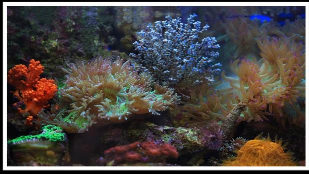
  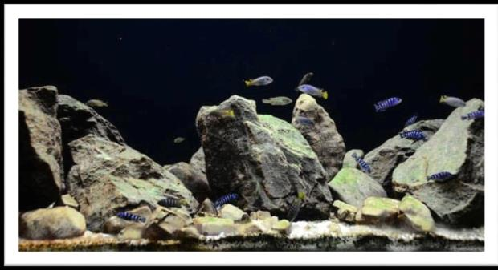

* **Fig 3.2 GROUNDING DINO Input (Open-Vocabulary Text Prompt)**
  * *Natural Language Text Query Prompt*: `"fish , coral reef , debris , underwater structure ."`

* **Fig 3.3 MARINE FORMER & AQUATIC CLIP Input**
  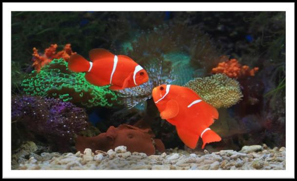

---
<!-- PAGE 11: CODE IMPLEMENTATION - PART 1 (Exactly one page!) -->

## CODE IMPLEMENTATION FOR ALGORITHM (UHD-UOD)

* **predict.py**
  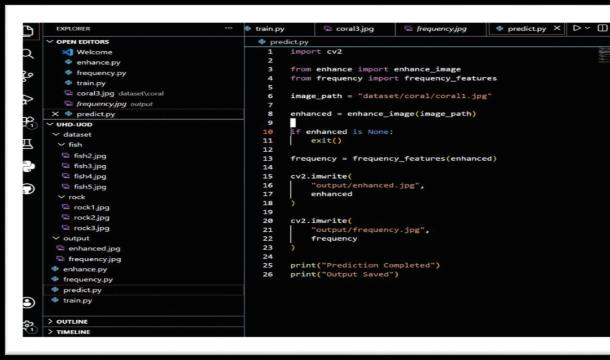

* **enhance.py**
  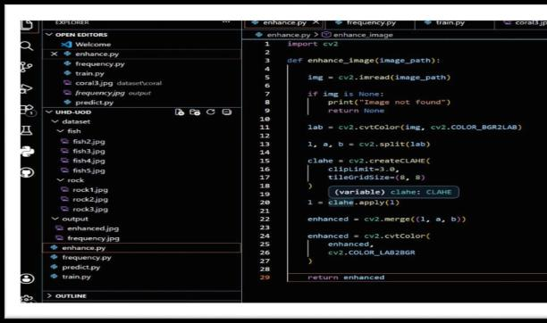

* **frequency.py**
  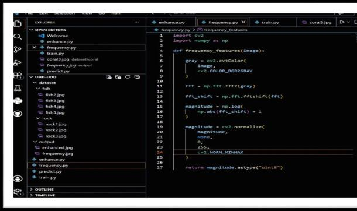

* **train.py**
  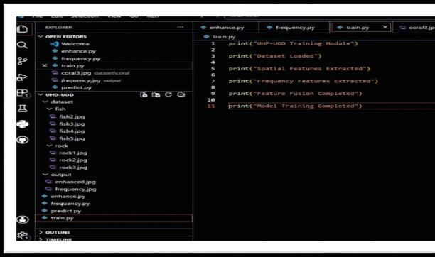

---
<!-- PAGE 12: CODE IMPLEMENTATION - PART 2 (Exactly one page!) -->

## CODE IMPLEMENTATION FOR ALGORITHM (Contd.)

* **GROUNDING DINO: detect_multiple.py**
  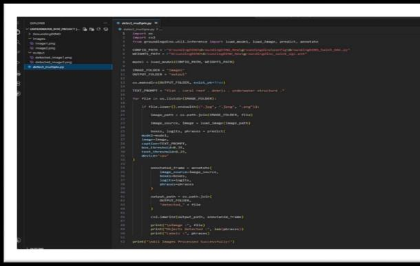

* **ROV ANALYSER Tkinter GUI launcher: main.py**
  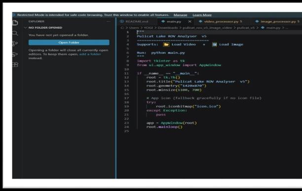

* **ROV ANALYSER Tkinter GUI Controller: image_processor.py**
  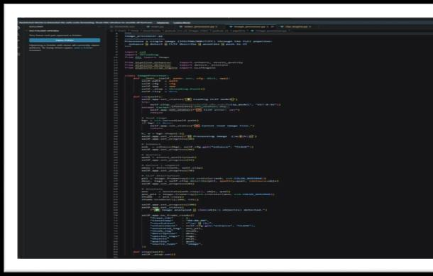

* **AQUATIC CLIP model setup: clip_engine.py**
  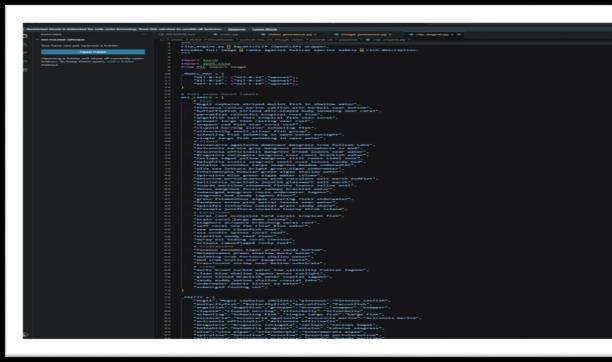

---
<!-- PAGE 13: OUTPUTS FOR ALGORITHM (Exactly one page!) -->

## OUTPUTS FOR ALGORITHM

All algorithm output visual results are organized on this page:

* **UHD-UOD Output (Enhanced Visual & FFT Magnitude)**
  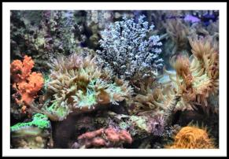
  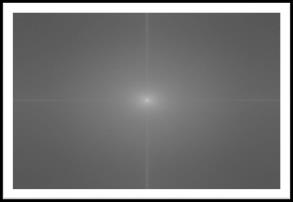

* **GROUNDING DINO Output (Detected Objects with Bounding Boxes)**
  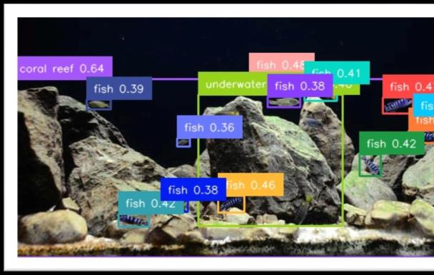

* **MARINE FORMER & AQUATIC CLIP Output (Intelligent Segmentations & Predictions)**
  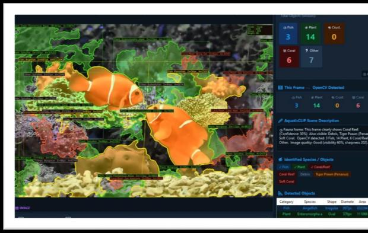
  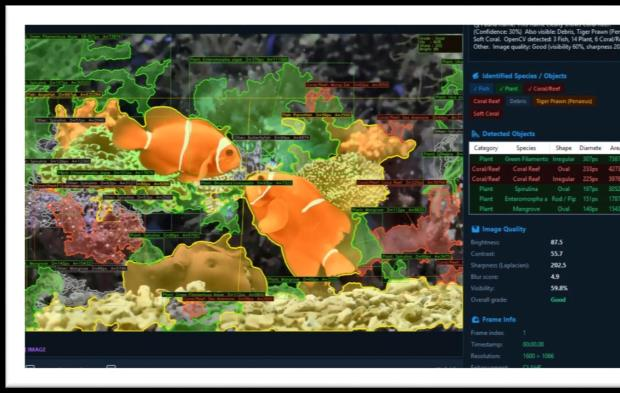

---
<!-- PAGE 14: WEEK 4 - PROJECT IMPLEMENTATION AND CONFERENCE PAPER SUBMISSION -->

## Week 4 – Project Implementation and Conference Paper Submission

During the fourth week of the NITTTR internship, the knowledge gained from the study of advanced underwater perception algorithms and the paper presentation activities was utilized to implement the proposed project titled **"AI-Based Underwater Scene Understanding and Intelligent Object Classification for ROV Operations."**

During the development process, various software tools and technologies such as **Python, OpenCV, PyTorch, Visual Studio Code, and Vision-Language Models** were utilized to build the framework. The implementation involved underwater image enhancement, feature extraction, underwater object detection, scene understanding, intelligent object classification, and visualization of results through an interactive user interface. UHD-UOD was implemented to enhance degraded underwater images through color correction, dehazing, contrast enhancement, and noise reduction. MarineFormer was used for transformer-based underwater scene understanding and contextual feature extraction. AquaticCLIP was integrated for semantic vision-language learning and underwater object classification, while Grounding DINO was employed for open-vocabulary detection and localization of underwater objects using natural language prompts. Extensive testing was performed using underwater image datasets containing fish, coral reefs, underwater vegetation, marine debris, pipelines, and submerged structures to evaluate the performance of the proposed framework. The obtained results demonstrated the effectiveness of the system in enhancing underwater images, accurately detecting and classifying underwater objects, understanding complex underwater scenes, and supporting intelligent decision-making for autonomous ROV operations.

In addition to project implementation, a conference paper was prepared based on the proposed framework. The paper included the problem statement, literature survey, proposed methodology, system architecture, algorithm descriptions, experimental analysis, results, and conclusions. The study highlighted the significance of integrating UHD-UOD, MarineFormer, AquaticCLIP, and Grounding DINO for intelligent underwater scene understanding and object classification. Finally, the conference paper was successfully completed and submitted for academic review, marking the successful completion of the internship project. The activities carried out during the fourth week provided valuable practical experience in research methodology, AI model implementation, underwater image processing, technical documentation, and scientific paper writing.

---
<!-- PAGE 15: CONCLUSION -->

## Conclusion:

The NITTTR internship provided an excellent opportunity to gain both theoretical knowledge and practical experience in the fields of **Artificial Intelligence, Deep Learning, Computer Vision, Underwater Image Processing, and Underwater Scene Understanding**. Throughout the internship, various advanced algorithms and Vision-Language Models were studied, analyzed, and presented to understand their applications in intelligent underwater exploration, marine environmental monitoring, and Remotely Operated Vehicle (ROV) operations. The internship activities enhanced our understanding of underwater image enhancement, transformer-based feature extraction, open-vocabulary object detection, semantic vision-language learning, and intelligent underwater scene interpretation using modern AI technologies.

During the internship, we successfully completed the project titled **"AI-Based Underwater Scene Understanding and Intelligent Object Classification for ROV Operations."** The proposed framework integrated advanced models such as UHD-UOD, MarineFormer, AquaticCLIP, and Grounding DINO to perform underwater image enhancement, underwater object detection, scene understanding, semantic analysis, and intelligent object classification. The implementation demonstrated the capability of deep learning and vision-language techniques to accurately analyze challenging underwater environments, identify marine organisms and underwater structures, and generate meaningful scene interpretations for autonomous ROV navigation and decision-making.

Furthermore, a conference paper was prepared and submitted based on the proposed project, documenting the research methodology, literature survey, system architecture, implementation process, algorithm descriptions, experimental analysis, and performance evaluation. The successful completion of the project and paper submission significantly improved our research, technical, programming, presentation, and scientific documentation skills.

Overall, we successfully completed the NITTTR internship and achieved all the planned objectives. The internship provided valuable exposure to emerging AI technologies, underwater computer vision, research-oriented thinking, and real-world problem-solving approaches for marine applications. The knowledge and skills gained during this internship will greatly contribute to our future academic projects, research activities, and professional careers in the fields of **Artificial Intelligence, Underwater Robotics, Computer Vision, and Intelligent Marine Systems**.
