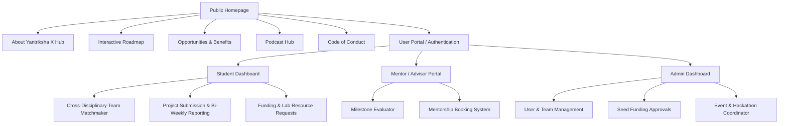

# Yantriksha X Hub: Website Specification & Technical Requirements Document

This document outlines the visual structure, functional modules, and technical requirements for the official website of **Yantriksha X Hub** (Innovation and Cross-Disciplinary Collaboration Hub) based at **Vel Tech Rangarajan Dr. Sagunthala R&D Institute of Science and Technology**.

---

## 1. Executive Summary & Club Overview

**Yantriksha X Hub** is a student-driven initiative designed to help students transform ideas into real-world products and startups. It bridges academic concepts and industry solutions by bringing together students from diverse fields: **Engineering**, **Law**, and **Business (MBA)**. 

The website's primary goal is to serve as the digital engine for this collaboration. It will facilitate team formation, roadmap tracking, event participation, mentorship, resource requests, and podcast access.

### The Three Transformation Stages
The website must visually and functionally guide users through the club's three developmental phases:
*   **Stage -1 (Confusion):** Helping unsure students apply their knowledge, find problems, and form cross-disciplinary teams.
*   **Stage 0 (Idea):** Supporting students with a defined problem to validate ideas, build prototypes, and address technical, legal, and business feasibility.
*   **Stage 1 (Product):** Assisting teams in refining prototypes into market-ready products, securing legal protections, and developing commercialization/go-to-market strategies.

---

## 2. Target Audience & Stakeholders

The website must cater to various stakeholder groups with customized dashboard views and permission levels:

1.  **Students (Primary Users):** Apply for membership, form cross-disciplinary teams, track project progress, register for events, and apply for seed funding.
2.  **Faculty Members:** Join teams as technical advisors, monitor student progress, and provide academic guidance.
3.  **Advisors / Mentors (Academic & Industry):** Track project milestones, provide bi-weekly feedback, and schedule virtual/offline mentorship sessions.
4.  **Alumni:** Offer mentorship, share career guidance, post internship/placement opportunities, and interact during sandbox events.
5.  **University Administration & Industry Relations Office:** Oversee resource allocation, approve seed funding (up to Rs. 50,000), and facilitate industry partnerships.
6.  **Investors & Venture Capitalists:** Review market-ready prototypes (Stage 1) for potential startup funding and scaling.

---

## 3. Website Sitemap & Information Architecture

The website will be organized into the following public pages and private portals:

### 3.1. Public Pages
*   **Home Page:** Hero section with a dynamic slogan ("*Don't let confusion stop you! Turn your ideas into reality.*"), overview stats (number of active projects, funding disbursed, industry partners), and clear Call-to-Actions (CTAs) for student registration, mentor onboarding, and alumni sign-up.
*   **About Us:** Outlines the purpose of the hub. Includes a detailed organization directory showcasing the leadership team:
    *   *President/Chairman:* Sannareddy Abhilash Reddy (VTU25922)
    *   *Secretary:* Garimalla Kiran Sai (VTU25463)
    *   *Treasurer:* Kondeti Nikitha (VTU26645)
    *   *Event Coordinators:* A Sahithi Keerthana (VTU26923) & M Varsha (VTU27290)
    *   *Marketing/Outreach:* P Hari Sai (VTU25137) & Innampudi Durga Vamsi Krishnam Raju (VTU25465)
    *   *Advisory Board:* Chief Advisor Dr. P. Chandrakumar, alongside advisors Dr. Mutharasan A, Dr. S. Vinson Joshua, Mr. Saleemnawaz M A, Mr. Sathyanathan, Prof. C. S. Sivakumar, and Dr. Arvind AR.
    *   *Alumni Relations:* Dean Mrs. Kasthuri. D.
*   **Interactive Roadmap Hub:** Visualizes the 14 roadmap steps with clickable modules to explain each step.
*   **Opportunities & Benefits Directory:** Explains the concrete incentives for joining:
    *   Seed Funding (up to Rs. 50,000 for prototype development).
    *   Academic Credits (2-9 credits under the Independent Learning Program).
    *   Sandbox Testing opportunities.
    *   Internships & placements from alumni and industry experts.
*   **"The Unwritten Lessons" Podcast Hub:** Embedded directory of episodes. Features video and audio players linked to YouTube and Spotify, sorting by sector, and a submit form for Q&A questions.
*   **Code of Conduct:** Displaying the core guidelines: Collaboration & Respect, Integrity, Punctuality, Ethical Practices, Professional Conduct, and Confidentiality.

---

## 4. Key Interactive Modules & Functional Requirements

To fulfill the requirements of Yantriksha X Hub, the website must go beyond static content and implement the following functional systems:

### 4.1. Cross-Disciplinary Team Matchmaker
*   **The Problem:** Teams require exactly 10 members and must be diverse (Engineering + Law + MBA).
*   **Web Solution:**
    *   A student creates a profile tagging their department (e.g., CSE, ECE, Law, MBA) and their sector of interest (e.g., Healthcare, FinTech, Agriculture, Renewable Energy).
    *   Students can post "Project Ideas" and list the empty roles they need to fill (e.g., "Need 1 Law student for IP assessment and 2 MBA students for market feasibility").
    *   An interactive team builder allows users to send join requests, auto-validating that the team composition complies with rules before formal submission.

### 4.2. Gamified 14-Stage Roadmap Tracker
The website should feature a progress tracker interface for student projects, moving sequentially through the 14 milestones:
1.  **Sector Selection & Team Formation:** Checks if the 10-member cross-disciplinary team is fully assembled.
2.  **Brainstorming & Feasibility Evaluation:** Prompts for technical (Engineering), market (MBA), and legal (Law) feasibility inputs.
3.  **Industry Expert Evaluation:** Portal for industry experts to review and classify the project as *Industry-Specific* or *Startup-Ready*.
4.  **Ideation & Prototype Design:** Workspace for uploading initial diagrams and design documents.
5.  **Resource & Tool Access Request:** A form to request access to Vel Tech engineering labs, design software, and simulation environments.
6.  **Seed Funding Application:** Apply for up to Rs. 50,000. Includes itemized budget inputs for materials, development tools, and hardware.
7.  **Mentor Engagement Scheduler:** Integrated booking system connecting student teams to Research Scholars (ongoing), and Industry Experts/Professors of Practice (weekly).
8.  **Bi-Weekly Progress Report Portal:** File upload and markdown editor for teams to submit bi-weekly progress reports to coordinators and industry mentors.
9.  **Intra-Collegiate Events Dashboard:** Register and track team status in internal hackathons and campus innovation challenges.
10. **Inter-Collegiate & National Competitions:** Portal to submit participation records for national events like the *Smart India Hackathon* or *Startup India Yatra*.
11. **Sandbox Testing Log:** Sign-up portal for the bi-monthly sandbox events to test prototypes in simulated real-world environments.
12. **Research & Publication Tracker:** Repository where students log academic papers and journals written during their project duration.
13. **Awards, Credits & Consultancy Logger:** Records certificate receipts, triggers requests for academic credit approvals (2-9 credits), and tracks industry consultancy allocations.
14. **Startup Commercialization Portal:** Connects high-performing Stage 1 graduates with venture capitalists, investors, and startup incubation support from Vel Tech TBI.

### 4.3. Digital Mentorship & Progress Review
*   **Bi-Weekly Review Flow:** When a team submits their bi-weekly report (Roadmap Step 8), their assigned mentors/coordinators receive an email/dashboard notification. Mentors can submit comments, rate progress, and approve or reject submissions.
*   **Booking System:** Integrates calendar schedules (Google Calendar or custom database slots) for weekly virtual or offline mentorship check-ins.

### 4.4. Funding & Budget Approval Workspace
*   Allows the Treasurer (Kondeti Nikitha) and Advisors to view all seed funding requests.
*   Shows status flags: `Pending Review`, `Approved by Advisor`, `Disbursed`, `Receipts Verified`.
*   Stores PDF invoices and documents for auditing.

---

## 5. Design System & User Experience (UX/UI)

The website design should project **innovation, collaboration, and high-tech credibility**. It must feel professional yet engaging for students and industry leaders alike.

### 5.1. Visual Style & Palette
*   **Theme:** Modern, sleek dark mode by default, with an elegant light mode toggle.
*   **Colors:**
    *   **Primary (Tech/Engineering):** Deep Cobalt / Electric Blue (`#0f52ba` / `#0070f3`) - Represents technology, structure, and engineering.
    *   **Secondary (Business/MBA):** Royal Gold / Amber Accent (`#d4af37` / `#ffaa00`) - Represents commercialization, funding, and success.
    *   **Tertiary (Law/Compliance):** Deep Crimson / Coral Grey (`#b22222` / `#4a5568`) - Represents legal structure, security, and ethics.
    *   **Backgrounds:** Matte dark gray/black (`#0B0F19`) or clean, high-contrast light backgrounds (`#F7FAFC`).
*   **Typography:** Google Fonts: **Outfit** or **Inter** for headings and text to give a clean, premium, geometric appearance.
*   **Visual Elements:** Glassmorphism cards (semi-transparent backgrounds with background blur), smooth CSS transition hover effects, and crisp SVG iconography for sectors and roadmap milestones.

---

## 6. Technical Architecture & Security Requirements

To support the requested features, the following technology stack and system parameters are recommended:

### 6.1. Recommended Technology Stack
*   **Frontend Framework:** **Next.js (React)** or **Vite (React)**. This allows for rich client-side interactivity (team builders, interactive roadmaps) and fast page speeds.
*   **Styling:** **Vanilla CSS / CSS Modules** to ensure highly customized, lightweight styling without third-party design leaks.
*   **Backend Services & Database:** **Supabase** or **Firebase**.
    *   *Authentication:* Built-in magic links or Google OAuth, mapped to Vel Tech student/faculty email domains.
    *   *Database:* PostgreSQL (via Supabase) to manage relational data (users, teams, sectors, roadmap checkpoints, reports).
    *   *Storage:* Secure bucket storage for progress reports, project prototype diagrams, and budget invoices.
*   **Hosting:** Hosted on **Vercel** or **Netlify** for instant deployment, CDNs, and high availability.

### 6.2. Security & Compliance
*   **Intellectual Property (IP) Protection:** Because students will be submitting startup concepts, access controls are critical. Prototype details, progress reports, and codebases must be restricted to verified team members, assigned faculty/mentors, and authorized coordinators.
*   **Code of Conduct Integration:** Users must read and check a box agreeing to the Code of Conduct (particularly the **Confidentiality** clause) upon initial registration.

---

## 7. Next Steps & Requirements checklist

To proceed with building the website, the following assets and requirements are needed from the Yantriksha X Hub team:

- [ ] **Domain & Hosting Credentials:** Decide if the site will run on a sub-domain (e.g., `yantriksha.veltech.edu.in`) or a custom domain (e.g., `yantrikshaxhub.com`).
- [ ] **Official Media & Assets:** High-resolution logos for Vel Tech, Yantriksha X Hub, IIC, and Vel Tech TBI.
- [ ] **Academic Credit Mapping:** Exact formulas or guidelines on how project weightage maps to the 2-9 academic credits under the Independent Learning Program.
- [ ] **Podcast Access:** Access links or API keys for Spotify and YouTube feeds for "The Unwritten Lessons" podcast.
- [ ] **Lab & Facility Details:** Directory of engineering labs, tools, and software licenses available to students so they can be integrated into the resource selection list.
